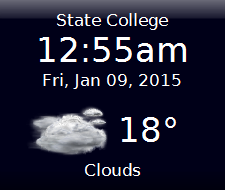
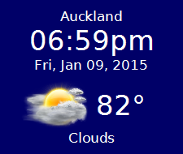

clocky
======

Clock and Weather desktop widget for Linux &amp; Windows.

Microsoft got rid of their Desktop Gadgets.  Well, I was quite partial to the weather and clock gadgets I was using.  So I decided to just make a replacement.

 

Clocky is built with Lazarus, a cross-platform, Open Source RAD IDE for FreePascal.  It is designed to compile on both Windows and Linux.  And it shouldn't be too much trouble to compile for OSX and other platforms supported by Lazarus.

Clocky pulls its weather data from OpenWeatherMap.org.  To use Clocky, you'll need a free API key from them.  It only takes a couple of seconds to get one.

Clocky supports up to 8 different Profiles.  Each can have its own location and time zone setting.  By default Clocky always launches the first profile.  But you can launch other profiles by providing their name as a command line parameter:

    clocky 4

You can also switch between profiles within the program itself using the menu.

####Installation and Configuration

If you just want to run the Clocky desktop widget, download the /dist directory of this repository to your machine into a directory named 'Clocky'.

Now go to [http://openweathermap.org/appid](http://openweathermap.org/appid "Open Weather Map's API page") and get an API Key.  It'll just take a moment.

To run the program, in Windows, simply run:

    Clocky.exe

In Linux, run

    ./Clocky

To configure Clocky to set city and time zone information, hover your mouse over the widget and click the small down arrow at the top right of the widget.  In the pop-up menu, select *Edit Configuration*.  That will open the configuration file in your default text editor.

Configuration files are stored, in Windows, under

    C:\Users\<Name>\AppData\Local\Clocky\Config

In Linux, it's stored in the user's home directory under

	.config/clocky/clocky.cfg 

The configuration file might looks something like this:

	[clocky]
	LocalTimeZone=-5
	OpenWeatherMapAPIKey=147f9111af7e56a37960f1af5c976cb4
    DefaultFontName=DejaVu Sans

	[Prof_1]
	Left=1928
	Top=19
	LocationTitle=State College
	Location=State College, PA
	BackgroundColor=$00180000
	FontName=Verdana
	Unit=F
	Iconset=VCloud
	LocationTimeZone=-5
	Flat=0

In the 'clocky' section of the ini file, there is:

**LocalTimeZone** - the number of hours you are after or before GMT.  EST standard time, for example is -4 or -5 during DST.  If its a partial hour, list it as a decimal, like 5.5.

**Open WeatherMapAPIKe**y - the API Key you obtained as mentioned above.

**DefaultFontName** - this is the default font to use for display in all the profiles.  If this value is not present, in Windows clocky defaults to *Arial*, and in Linux to the default *sans serif* font.

Below the 'clocky' section is the information for the different profiles.  They are titled `Prof_1` to `Prof_8`.   

The options are:

**LocationTitle** - this is the name that is displayed at the top of your widget for this profile.

**Location** - this is the location string passed to the weather API.  In the US it is typically City, State.  If you have trouble identifying what to put here, you might try the strings out at OpenWeatherMap.org.

**BackgroundColor** - Hexidecimal ARGB value for the background color.  $00000000 is black, and is default.  You can also use FreePascal/Delphi style constants, such as clNavy and clMaroon.

**FontName** - this is the font to use for display in this profile.  If not present, defaults to DefaultFontName in the 'clocky' section.

**Unit** - The unit you want to display temperatures in, either F or C.

**Iconset** - Hard coded to VCloud right now, but will be used to support other icon sets.

**LocationTimeZone** - The hours before/after GMT for this location.

**Flat** - If set to 0 (default), the widget is drawn with a beveled style/raised style.  If 1, the widget is drawn flat with no bevel.

**Left**, **Top** - The position, in Pixels.  There is no need to set this as the widget can be dragged anywhere on the desktop.  But you somehow get it off the screen this is useful.

To add a new Profile, just add the section to the config file, using any of `Prof_1` to `Prof_8`.

####Todo's
- Geoip check on start to configure first profile.
- Add Yahoo, Weather.com, and other profiles.

####Acknowledgments
 - Clocky's icons are from the VCloud collection: [http://vclouds.deviantart.com/gallery/#/d2ynulp](http://vclouds.deviantart.com/gallery/#/d2ynulp)